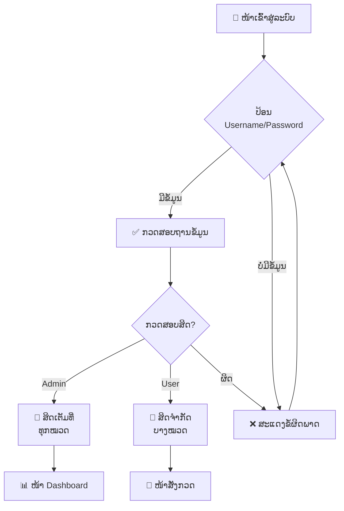
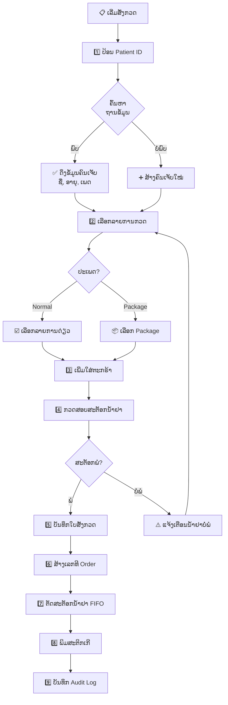
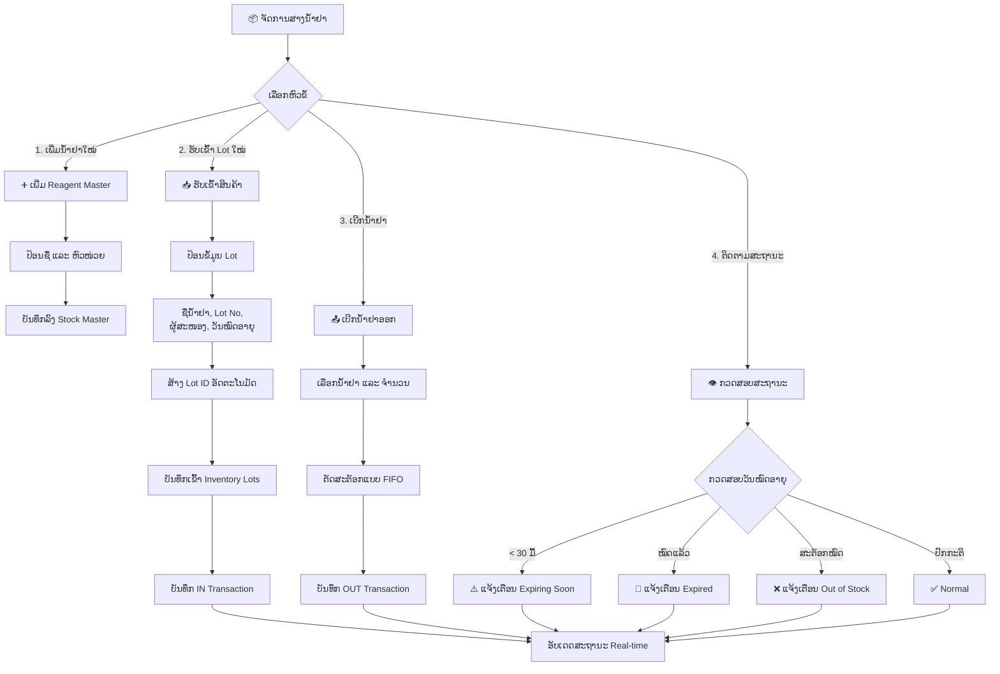
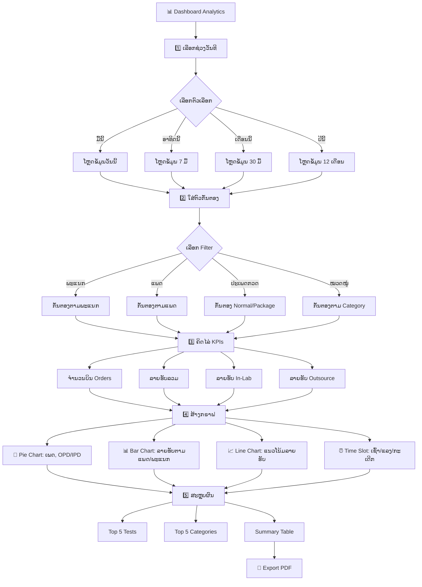
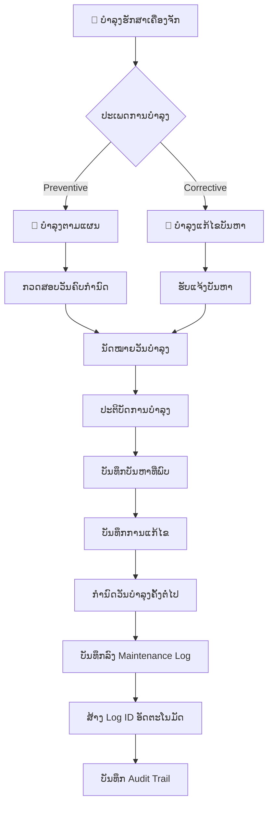
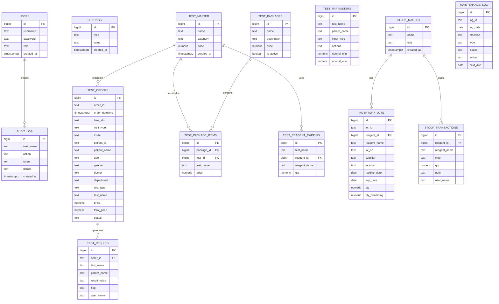
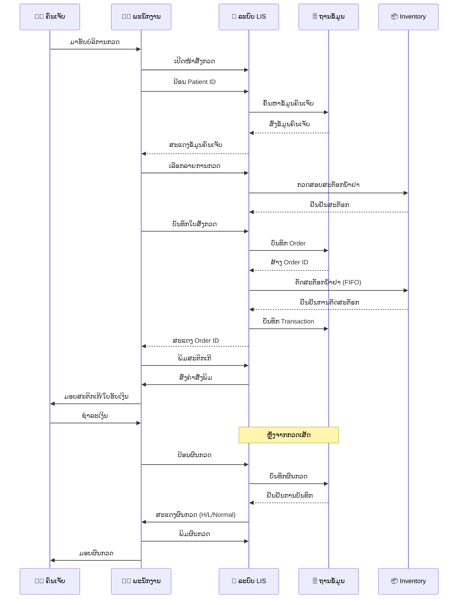
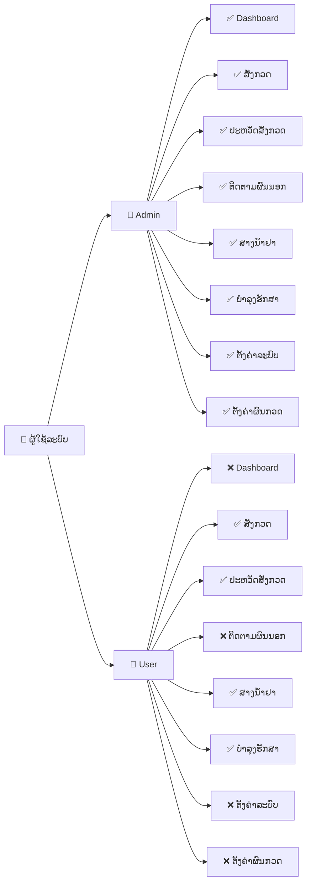
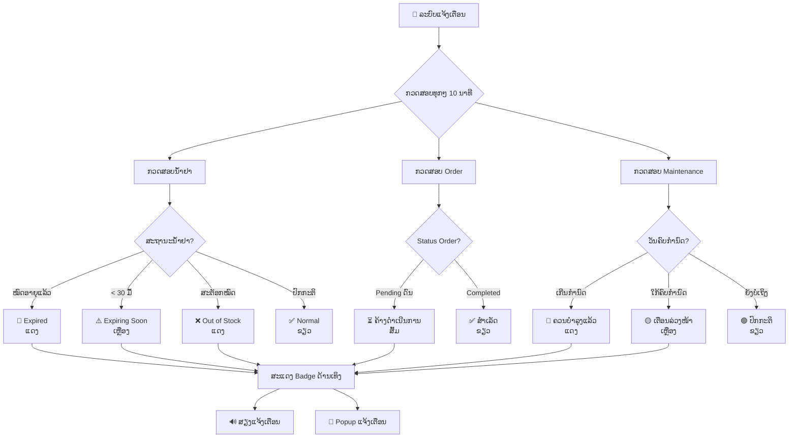
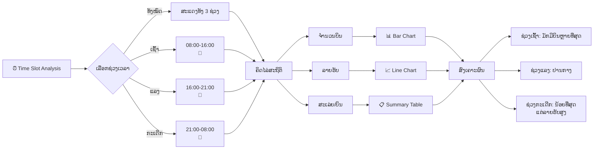

# ແຜນຜັງລະບົບ LIS (Laboratory Information System)

## ຄຳອະທິບາຍ
ໄຟລ໌ນີ້ແມ່ນແຜນຜັງລະບົບ LIS ທີ່ສາມາດເບິ່ງໄດ້ດ້ວຍ Mermaid Viewer
Website: https://mermaid.live/

---

## 1. ແຜນຜັງການເຂົ້າສູ່ລະບົບ (Login Flow)

---

## 2. ແຜນຜັງການສັ່ງກວດ (Test Order Flow)

---

## 3. ແຜນຜັງການຈັດການສາງນ້ຳຢາ (Inventory Flow)

---

## 4. ແຜນຜັງ Dashboard Analytics

---

## 5. ແຜນຜັງການບຳລຸງຮັກສາເຄື່ອງຈັກ (Maintenance Flow)

---

## 6. ແຜນຜັງໂຄງສ້າງຖານຂໍ້ມູນ (Database Schema)

---

## 7. ແຜນຜັງຂັ້ນຕອນການເຮັດວຽກລວມ (End-to-End Process)

---

## 8. ແຜນຜັງສິດການໃຊ້ງານ (User Permission Matrix)

---

## 9. ແຜນຜັງການແຈ້ງເຕືອນ (Alert System Flow)

---

## 10. ແຜນຜັງ Time Slot Analysis

---

## ວິທີໃຊ້ໄຟລ໌ນີ້

1. **ເບິ່ງແຜນຜັງອອນລາຍ**: ໄປທີ່ https://mermaid.live/
2. **Copy-Paste**: ຄັດລອກໂຄ້ດ Mermaid ແຕ່ລະສ່ວນໄປວາງ
3. **Export**: ບັນທຶກເປັນ PNG, SVG ຫຼື PDF

---

## ຂໍ້ມູນເພີ່ມເຕີມ

- **Version**: 1.0
- **Last Updated**: 2026-03-31
- **System**: LIS Test By No V2
- **Database**: Supabase PostgreSQL
